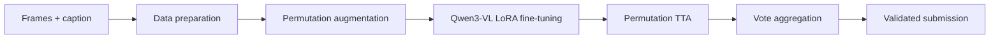

# SNU AI Challenge: Video Frame Ordering

> A single-model vision-language pipeline that restores the chronological order of four shuffled video frames from visual evidence and an English caption.

**Test Exact Match: 0.88**<br>
**Model:** Qwen3-VL-8B with LoRA fine-tuning<br>
**Constraint:** one model only, no external training data, and offline inference within 24 hours

## Project at a glance

The task is to assign each of four shuffled video frames its original temporal rank. A prediction receives credit only when all four ranks are correct, making Exact Match a demanding end-to-end metric.

| Area | Implementation |
| --- | --- |
| Input | Four shuffled frames and a temporally ordered English caption |
| Model | Qwen3-VL-8B, LoRA supervised fine-tuning |
| Training | Frame permutation augmentation and caption-event supervision |
| Inference | Permutation-based test-time augmentation and vote aggregation |
| Validation | Caption-grouped 90:10 split to reduce near-duplicate leakage |
| Final result | **0.88 test Exact Match** |

## Approach



### 1. Treat order recovery as a multimodal reasoning task

The model jointly uses visual transitions across frames and temporal cues in the caption, such as `then`, `before`, and `finally`, to infer a globally consistent frame order.

### 2. Remove positional shortcuts with permutation augmentation

During training, the four input frames are shuffled repeatedly and labels are converted with a tested permutation utility. This expands the provided data without external examples and prevents the model from treating input position as a temporal cue.

### 3. Improve robustness at inference time

Each sample is evaluated under multiple input permutations. Predictions are mapped back to the original coordinates and aggregated by vote. This retains the competition's single-model requirement while reducing sensitivity to frame position.

### 4. Build around the competition constraints

- No external training data
- No multi-model ensemble
- Offline inference only
- Full test inference must finish within 24 hours
- Exact Match scoring, with no partial credit

## Results

| Milestone | Model and strategy | Exact Match |
| --- | --- | ---: |
| Baseline | Qwen2-VL zero-shot | 0.10 |
| Early submission | 3B VLM with permutation TTA | 0.71 |
| Scaling milestone | 7B VLM with vote aggregation | 0.81 |
| Final submission | Qwen3-VL-8B, LoRA, permutation TTA | **0.88** |

The central improvement came from combining a stronger vision-language model with augmentation and aggregation designed specifically for the ranking label format and single-model rule.

## Repository guide

```text
configs/       Training and runtime configuration
src/data/      Data loading and train-validation splitting
src/preprocess/ Data cleaning and caption augmentation
src/train/     Dataset construction and training targets
src/infer/     Prediction, vote aggregation, and submission validation
src/eval/      Exact Match evaluation
tests/         Tests for permutation logic and pipeline safeguards
reports/       Experiment logs and analysis
docs/          Rules, findings, and detailed project guide
```

## Reproduce the workflow

```bash
# Install dependencies
pip install -r requirements.txt

# Create the grouped train-validation split
python -m src.data.split

# Build supervised training targets
python -m src.train.cot_target
```

Training and final inference require a CUDA-capable GPU. See [the detailed project guide](docs/project-guide.md) for the full workflow, [experiment reports](reports/) for decisions and ablations, and [competition rules](docs/rules.md) for constraints.

## Notes on reproducibility

Competition data, model weights, generated outputs, and credentials are intentionally excluded from version control. Paths are configured through `configs/paths.yaml`; use the included tests to validate permutation and submission handling before an experiment or submission.

## Tech stack

Python, PyTorch, Transformers, PEFT, Qwen-VL, pandas, Pillow, scikit-learn, pytest, RunPod, Google Colab
